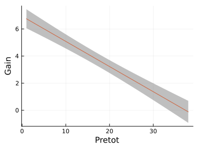

# Estimating Equations Regression in Julia

This package fits regression models to data using estimating equations.
Estimating equations are useful for carrying out regression analysis
when the data are not independent, or when there are certain forms
of heteroscedasticity.  This package currently support three methods:

* Generalized Estimating Equations (GEE)

* Quadratic Inference Functions (QIF)

* Generalized Expectile Estimating Equations (GEEE)

````julia
using EstimatingEquationsRegression, Random, RDatasets, StatsModels, Plots

# The example below fits linear GEE models to test score data that are clustered
# by classroom, using two different working correlation structures.
da = dataset("SASmixed", "SIMS")
da = sort(da, :Class)
f = @formula(Gain ~ Pretot)

# m1 uses an independence working correlation (by default)
m1 = fit(GeneralizedEstimatingEquationsModel, f, da, da[:, :Class])

# m2 uses an exchangeable working correlation
m2 = fit(GeneralizedEstimatingEquationsModel, f, da, da[:, :Class],
         IdentityLink(), ConstantVar(), ExchangeableCor())
````

````
StatsModels.TableRegressionModel{EstimatingEquationsRegression.GeneralizedEstimatingEquationsModel{EstimatingEquationsRegression.GEEResp{Float64}, EstimatingEquationsRegression.DensePred{Float64}}, Matrix{Float64}}

Gain ~ 1 + Pretot

Coefficients:
──────────────────────────────────────────────────────────────────────────
                 Coef.  Std. Error       z  Pr(>|z|)  Lower 95%  Upper 95%
──────────────────────────────────────────────────────────────────────────
(Intercept)   6.93691    0.36197     19.16    <1e-81   6.22746    7.64636
Pretot       -0.185577   0.0160356  -11.57    <1e-30  -0.217006  -0.154148
──────────────────────────────────────────────────────────────────────────
````

The within-classroom correlation:

````julia
corparams(m2)
````

````
0.2569238150456968
````

The standard deviation of the unexplained variation:

````julia
sqrt(dispersion(m2.model))
````

````
5.584595437738074
````

Plot the fitted values with a 95% pointwise confidence band:

````julia
x = range(extrema(da[:, :Pretot])..., 20)
xm = [ones(20) x]
se = sum((xm * vcov(m2)) .* xm, dims=2).^0.5 # standard errors
yy = xm * coef(m2) # fitted values
plt = plot(x, yy; ribbon=2*se, color=:grey, xlabel="Pretot", ylabel="Gain",
           label=nothing, size=(400,300))
plt = plot!(plt, x, yy, label=nothing)
Plots.savefig(plt, "assets/readme1.svg")
````

````
"/home/kshedden/Projects/julia/EstimatingEquationsRegression.jl/assets/readme1.svg"
````



For more examples, see the examples folder and the unit tests in the test folder.

## References

Longitudinal Data Analysis Using Generalized Linear Models. KY Liang, S Zeger (1986).
https://www.biostat.jhsph.edu/~fdominic/teaching/bio655/references/extra/liang.bka.1986.pdf

Efficient estimation for longitudinal data by combining large-dimensional moment condition.
H Cho, A Qu (2015). https://projecteuclid.org/journals/electronic-journal-of-statistics/volume-9/issue-1/Efficient-estimation-for-longitudinal-data-by-combining-large-dimensional-moment/10.1214/15-EJS1036.full

A new GEE method to account for heteroscedasticity, using assymetric least-square regressions.
A Barry, K Oualkacha, A Charpentier (2018). https://arxiv.org/abs/1810.09214

---

*This page was generated using [Literate.jl](https://github.com/fredrikekre/Literate.jl).*

