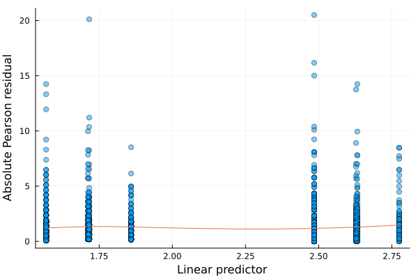

```@meta
EditURL = "<unknown>/hospitalstay.jl"
```

## Length of hospital stay

Below we look at data on length of hospital stay for patients
undergoing a cardiovascular procedure. We use a log link function so
the covariates have a multiplicative relationship to the mean length
of stay,

This example illustrates how to assess the goodness of fit of the
variance struture using a diagnostic plot, and how the variance
function can be changed to a non-standard form.  Modeling the
variance as μ^p for 1<=p<=2 gives a Tweedie model, and when p=1 or
p=2 we have a Poisson or a Gamma model, respectively.  For 1<p<2,
the inference is via quasi-likelihood as the score equations solved
by GEE do not correspond to the score function of the log-likelihood
of the data (even when there is no dependence within clusters).

````julia
using EstimatingEquationsRegression, RDatasets, StatsModels, Plots, Loess

azpro = dataset("COUNT", "azpro")

# Los = "length of stay"
azpro[!, :Los] = Float64.(azpro[:, :Los])

# The data are clustered by Hospital.  GEE requires that
# the data be sorted by the cluster id.
azpro = sort(azpro, :Hospital)

# Fit a model for the length of stay in terms of three explanatory
# variables.
m1 = fit(GeneralizedEstimatingEquationsModel,
         @formula(Los ~ Procedure + Sex + Age75), azpro, azpro[:, :Hospital],
         LogLink(), IdentityVar(), ExchangeableCor())

# Plot the absolute Pearson residual on the fitted value
# to assess for a mean/variance relationship.
f = predict(m1.model; type=:linear)
r = resid_pearson(m1.model)
r = abs.(r)
p = plot(f, r, seriestype=:scatter, markeralpha=0.5, label=nothing,
         xlabel="Linear predictor", ylabel="Absolute Pearson residual")
lo = loess(f, r)
ff = range(extrema(f)..., 100)
fl = predict(lo, ff)
p = plot!(p, ff, fl, label=nothing)
savefig(p, "hospitalstay.svg")
````

````
"/home/kshedden/Projects/julia/EstimatingEquationsRegression.jl/examples/hospitalstay.svg"
````



````julia
# Assess the extent to which repeated length of stay values for the same
# hospital are correlated.
 corparams(m1)

# Assess for overdispersion.
dispersion(m1.model)

m2 = fit(GeneralizedEstimatingEquationsModel,
         @formula(Los ~ Procedure + Sex + Age75), azpro, azpro[:, :Hospital],
         LogLink(), PowerVar(1.5), ExchangeableCor())
````

````
StatsModels.TableRegressionModel{EstimatingEquationsRegression.GeneralizedEstimatingEquationsModel{EstimatingEquationsRegression.GEEResp{Float64}, EstimatingEquationsRegression.DensePred{Float64}}, Matrix{Float64}}

Los ~ 1 + Procedure + Sex + Age75

Coefficients:
──────────────────────────────────────────────────────────────────────────
                 Coef.  Std. Error      z  Pr(>|z|)   Lower 95%  Upper 95%
──────────────────────────────────────────────────────────────────────────
(Intercept)   1.71353    0.0350195  48.93    <1e-99   1.64489     1.78217
Procedure     0.920412   0.0399206  23.06    <1e-99   0.842169    0.998655
Sex          -0.151386   0.0190783  -7.94    <1e-14  -0.188779   -0.113994
Age75         0.146486   0.0272245   5.38    <1e-07   0.0931269   0.199845
──────────────────────────────────────────────────────────────────────────
````

---

*This page was generated using [Literate.jl](https://github.com/fredrikekre/Literate.jl).*

